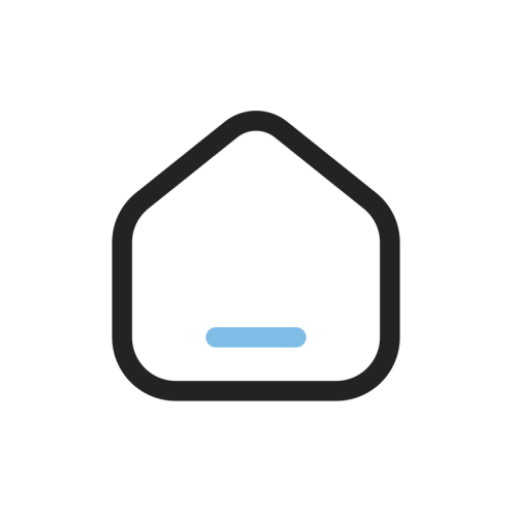
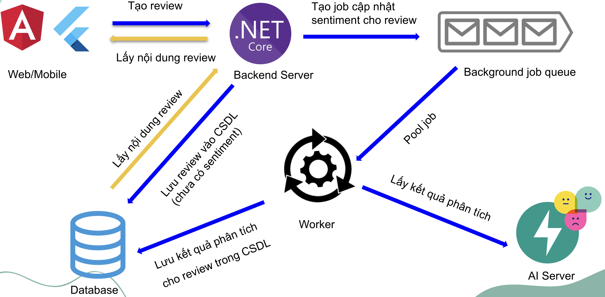
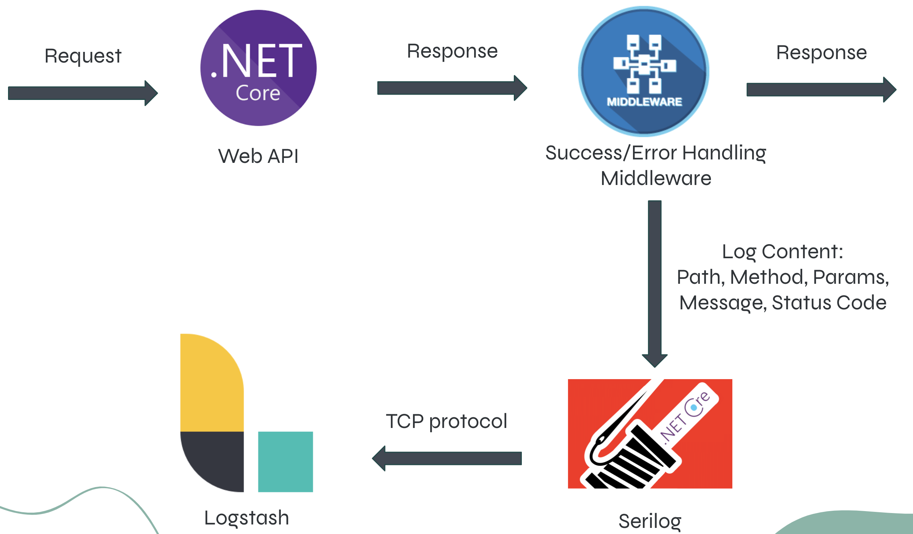
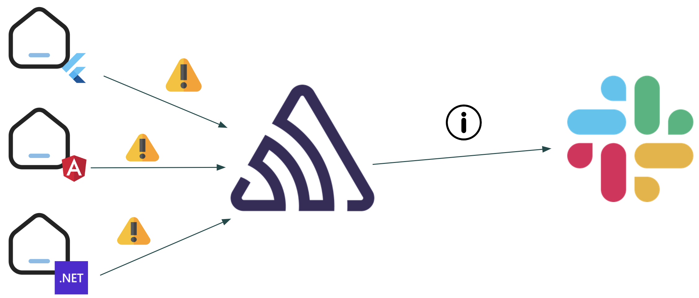
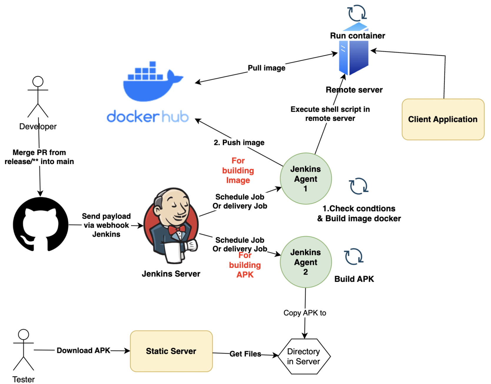

# Homie - INN Findor System - Backend



An INN Findor System web api created by PBL6 Team 🤖

## Features 🔥

- Authentication
- Authorization with Role and Permission
- Create, View, Delete, Edit, Search, Filter, Uptop Rental post
- Review post, create booking to view rental house
- Review evaluation analysis
- User management
- User post management
- Booking management
- Bookmark management
- Statistics
- Payment management (VNPAY)
- Notifications

## Technologies used 💪

- [.NET 6](https://dotnet.microsoft.com/en-us/download/dotnet/6.0): API development.
- [NuGet](https://www.nuget.org/): Package manager for .NET.
- [MySQL](https://www.mysql.com/): Relational database for project.
- [Serilog](https://serilog.net/): Success and error request/response logging.
- [Elastic Stack](https://www.elastic.co/elastic-stack/): Log storage and visualization.
- [Sentry](https://sentry.io/): Performance monitoring and error tracking.
- [Slack](https://slack.com/): Receive notifications from sentry.
- [Jenkins](https://www.jenkins.io/): CI – Continuous Integration and CD - Continuous Delivery.
- [Docker](https://www.docker.com/): Web application containerization
- [AWS](https://aws.amazon.com/): EC2 – Elastic Compute Cloud and S3 - Simple Storage Service.

## System Design for combining AI ️🎨



## Logging flow ️🌈



## Monitoring flow ️⛱️



## CI/CD flow ️🌟



## Platforms 🚀

This project contains 2 flavors:

- Local run by .NET CLI
- Run docker image

To run the desired flavor either use the launch configuration in VSCode/Terminal or use the following commands with env variables:

```sh
# Development
$ dotnet run / dotnet watch
``
# Docker
$ docker run -d --name "your-container-name" -p "your-port":80 hovanvydut/pbl6-be-monolithic
```

### Docker image

<a href='https://hub.docker.com/r/hovanvydut/pbl6-be-monolithic'>
</a>


## Contributor 🌟

<table>
  <tr>
    <td align="center"><br /><sub><b>Truong Minh Phuoc</b></sub></a><br /><a href="https://github.com/hovanvydut/pbl6-be-monolithic/commits?author=phuocleoceo" title="Backend Dev">💻</a> 
    <td align="center"><br /><sub><b>Ho Van Vy</b></sub></a><br /><a href="https://github.com/hovanvydut/pbl6-be-monolithic/commits?author=hovanvydut" title="Backend Dev & Devops">💻🛠</a>
</tr>

</table>
